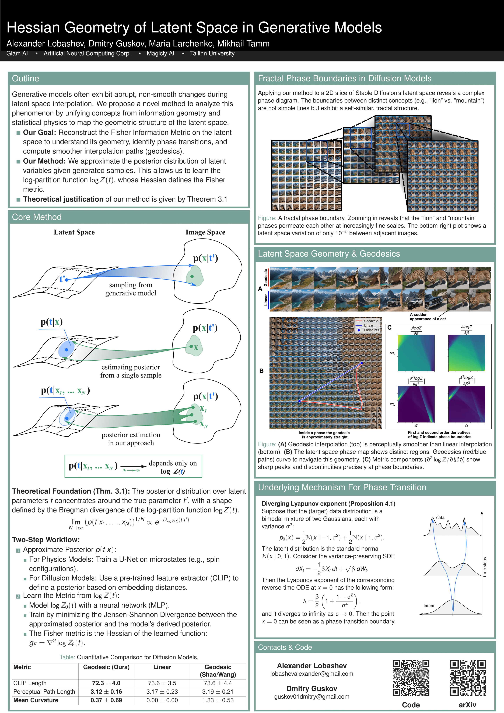

# [ICML 2025] Hessian Geometry of Latent Space in Generative Models

📄 This repository contains code and experiments for our paper:

**"Hessian Geometry of Latent Space in Generative Models"**  by Alexander Lobashev, Dmitry Guskov, Maria Larchenko, Mikhail Tamm 
Accepted to **ICML 2025**

## 📝 Abstract

This paper presents a novel method for analyzing the latent space geometry of generative models, including statistical physics models and diffusion models, by reconstructing the Fisher information metric. 
The method approximates the posterior distribution of latent variables given generated samples and uses this to learn the log-partition function, which defines the Fisher metric for exponential families. 
Theoretical convergence guarantees are provided, and the method is validated on the Ising and TASEP models, outperforming existing baselines in reconstructing thermodynamic quantities. 
Applied to diffusion models, the method reveals a fractal structure of phase transitions in the latent space, characterized by abrupt changes in the Fisher metric. 
We demonstrate that while geodesic interpolations are approximately linear within individual phases, this linearity breaks down at phase boundaries, where the diffusion model exhibits a divergent Lipschitz constant with respect to the latent space. 
These findings provide new insights into the complex structure of diffusion model latent spaces and their connection to phenomena like phase transitions.

## Poster

## Guide 
1. **Compute dataset**
   Run `generate_grid.py` to generate a grid of images from interpolated latent anchors. This script will save all generated images (as `.npy` files) into your specified output folder.

2. **Prepare training data**
   Open `prepare_data.ipynb` to convert the raw images into:

   * **States**: an array of shape `(N, 3, 128, 128)`
   * **Labels**: the generation parameters for each image, shape `(N, 2)`
   * **Targets**: a Gaussian-smoothing of those parameters over the 128×128 grid, shape `(N, 1, 128, 128)`
     Alternatively, to train directly on CLIP embeddings, run `Prepare_CLIP_states.ipynb`, which replaces the image states with CLIP vectors.

3. **Train the posterior U‑Net**
   Execute `train-posterior-unet-diffusion-clip.py` to train your U‑Net model to predict the parameter distribution (the “targets”) from each state (either image or CLIP embedding).

4. **Compute CLIP‑based posteriors**
   Use `compute_clip_based_posteriors.py` to estimate a reference posterior by measuring distances between CLIP embeddings. Save these distributions for later comparison against your learned U‑Net output.

5. **Train the free‑energy predictor**
   In `Free_Energy_Integration.ipynb`, fit a convex free‑energy function whose derivative matches the U‑Net’s predicted distributions. This notebook walks through integrating the predicted posteriors to recover the log‑partition (free energy).

**Directory structure**

* **figures/**
  Contains all static visualization assets used in the paper and poster. For example:

* **notebooks/**
  Jupyter notebooks for data preparation, model training, and analysis:

  * `Free_Energy_Integration.ipynb` – integrate U‑Net outputs to recover the free‑energy (log‑partition)
  * `Generate_plot_grid_SD15_Dreamshaper.ipynb` – visualize sample grids from the diffusion model
  * `Prepare_CLIP_states.ipynb` – convert images to CLIP embeddings as U‑Net inputs
  * `prepare_data.ipynb` – build `(states, labels, targets)` arrays from raw `.npy` images

* **scripts/**
  Standalone Python scripts for dataset generation, embedding computation, posterior estimation, and model training:

  * `generate_grid.py` – generate image grid from interpolated latent anchors
  * `compute_embeddings.py` – extract CLIP embeddings from saved `.npy` images
  * `compute_clip_based_posteriors.py` – reference posterior via CLIP‑embedding distances
  * `compute-equidistant-geodesics.py` – compute geodesic paths in latent Fisher geometry
  * `train-posterior-unet-diffusion-clip.py` – train U‑Net to predict parameter distributions from CLIP embeddings
  * `train-posterior-unet-ising.py` – train U‑Net on Ising‑model images

* **src/**
  Core model definitions and utility modules:

  * `U2Nets.py` – U‑Net architectures and helper functions

* **weights/**
  Trained model checkpoints:

  * `conv_model_diff_clip_v1.pt` – posterior U‑Net trained on diffusion+CLIP embeddings
